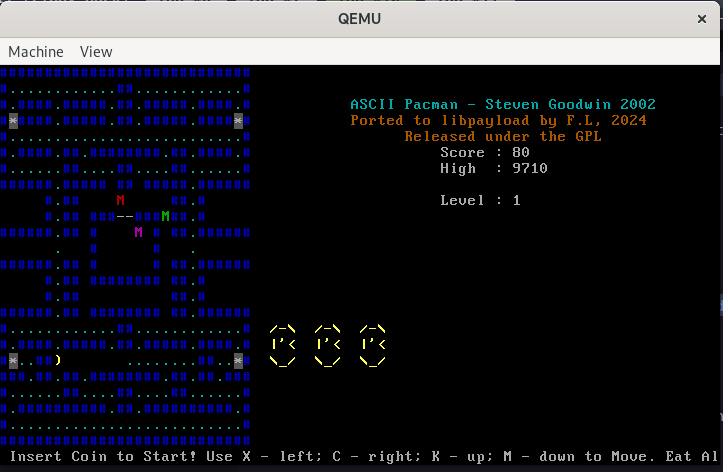

# Pacman-libpayload

ASCII Pacman game, written with curses, ported to libpayload to be used with
coreboot. Works with both regular video output and in headless mode over
serial console.



## Running

Grab the latest release, and run `qemu-kvm -bios pacman_qemu_q35.rom -M q35`.

## Building

* Build libpayload
* Start from `coreboot/payloads/pacman` or edit the `lpgcc` path in Makefile
* Run `make`
* Build coreboot for your platform of choice with `An ELF executable payload`
option pointing to the built `pacman` file.
* Flash the `coreboot.rom` onto hardware, or run
`qemu-kvm -bios coreboot.rom -M q35` if you've built for the emulation target.

## Playing

 Use the keys:

```
  x - left
  c - right
  k - up
  m - down
```
to move.
